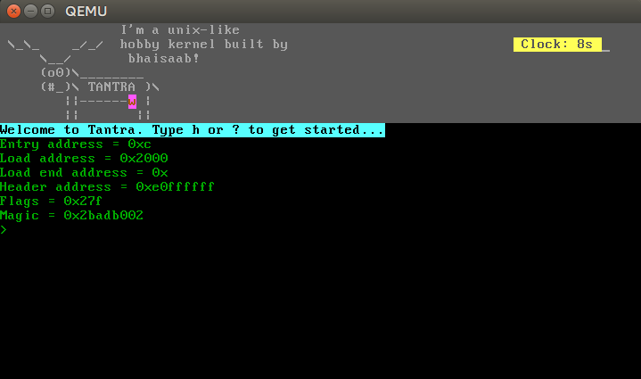

# Tantra

<pre>
 \_\_    _/_/       <b>Tantra</b>
     \__/           /तंत्र/ n. System (<a href="https://en.wikipedia.org/wiki/Sanskrit">sanskrit</a>)
     (o0)\________  Hobby unix-like x86 kernel
     (#_)\ tantra )\
         ||------w |
         ||       ||
</pre>

## Building

Available build profiles:

    make all
    make iso
    make run
    make run-qemu

### Debugging

Use bochs to step into instructions and see registers in action:

    make run

### Roadmap

Things that are yet to be implemented:

- Fairly useful libc
- Improving x86 paging and frame mapping/allocation
- Implement syscalls and errnos (s/w based interrupts)
- Refactor and improve memory management and heap allocation (sbrk, malloc, free etc)
- Implement Virtual File System and ext2/custom-fs implementation
- Fix build system to move away from iso to a real HDD
- Init ramdisk
- Implement multitasking, COW, processes (fork etc)
- Implement scheduler for user processes
- Usermode apps: init, shell, fs related (mkdir, ls etc), cat, echo, etc.
- Support multiple cpus/core, SMP
- VGA graphics
- Networking

## References

### Tutorials

- [The little OS book](https://littleosbook.github.io)
- [James Molloy's Roll your own toy unix-clone](http://www.jamesmolloy.co.uk/tutorial_html)
- [Brokethorn's OS dev](http://www.brokenthorn.com/Resources/OSDevIndex.html)
- [OSDever Tutorial](http://www.osdever.net/bkerndev/Docs/intro.htm)
- [Writing simple OS from Scratch](http://www.cs.bham.ac.uk/~exr/lectures/opsys/10_11/lectures/os-dev.pdf)
- [GDB Tutorial](http://beej.us/guide/bggdb/)

### Examples

- [MIT xv6 and 6.828](http://pdos.csail.mit.edu/6.828/2014/schedule.html)
- [Potato teaching OS](https://github.com/dbader/potatoes)
- [Adelaideos Teaching OS](http://adelaideos.sourceforge.net)
- [Sortix](https://sortix.org)
- [Aenix](https://github.com/helino/aenix)
- [JS linux](https://github.com/levskaya/jslinux-deobfuscated)

### Articles

- [Intel processor manuals](http://www.intel.com/products/processor/manuals/index.htm)
- [What every programmer should know about memory](https://www.akkadia.org/drepper/cpumemory.pdf)
- [Motherboard chipsets and the memory map](http://duartes.org/gustavo/blog/post/motherboard-chipsets-memory-map/)
- [How Computers Boot Up](http://duartes.org/gustavo/blog/post/how-computers-boot-up/)
- [Kernel boot process](http://duartes.org/gustavo/blog/post/kernel-boot-process/)
- [Memory Translation and Segmentation](http://duartes.org/gustavo/blog/post/memory-translation-and-segmentation/)
- [CPU Rings, Privilege, and Protection](http://duartes.org/gustavo/blog/post/cpu-rings-privilege-and-protection/)

### Linux

- [Linux Inside](https://0xax.gitbooks.io/linux-insides/content/)
- [Eudyptula Challenge: Linux programming](http://eudyptula-challenge.org/)
- [Linux Kernel Module Programming](http://www.tldp.org/LDP/lkmpg/2.4/html/book1.htm)

### Theory

- [OS Study Guide](http://www.sal.ksu.edu/faculty/tim/ossg/index.html)
- [OS: 3 Easy pieces](http://pages.cs.wisc.edu/~remzi/OSTEP/)
- [Computer Science from Bottom Up](http://www.bottomupcs.com/index.html)
- [A COMMENTARY ON THE SIXTH EDITION UNIX OPERATING SYSTEM](http://warsus.github.io/lions-/)
